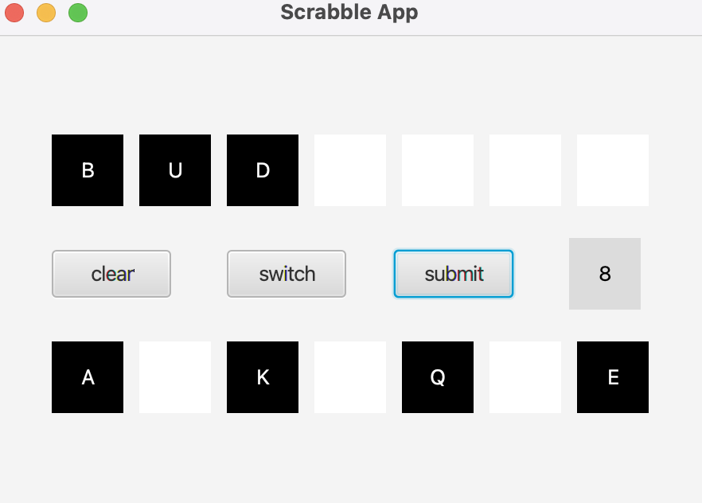
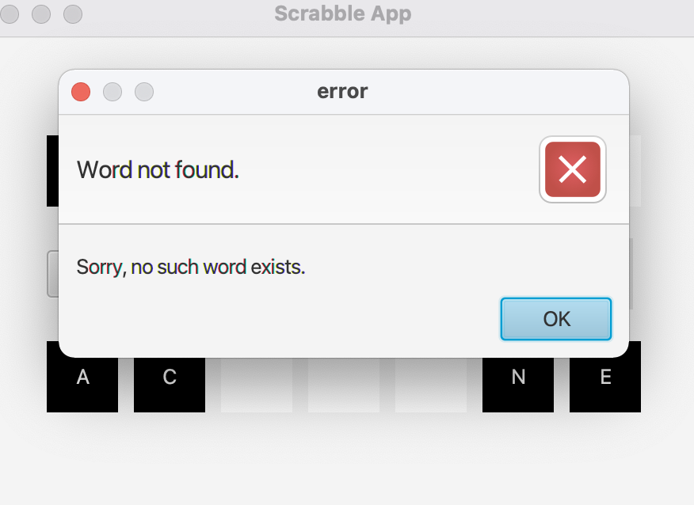

# Scrabble Application
This is a scrabble like game where the user attempts to enter a word from his given letters.

If the word exists in the dictionary, he gets points.

The points are as follows:
* 2 letter word:  11 points
* 3 letter word:  3 points
* 4 letter word:  5 points
* 5 letter word:  7 points
* 6 letter word:  11 points
* 7 letter word:  13 points

If the word doesn't exist in the dictionary, he gets an error message and the tiles go back down.

